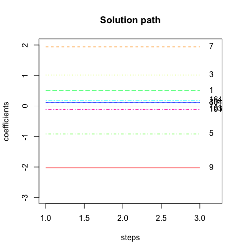
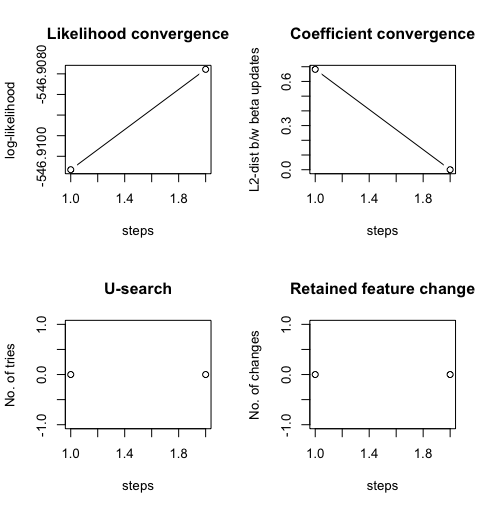

```{r setup, include=FALSE}
knitr::opts_chunk$set(echo = TRUE)
```

\newcommand{\code}[1]{\texttt{#1}}

## Introduction

This vignette describes how to use the **SMLE** package to perform Ultra-high dimensional feature screening.

Suppose the data $\{(y_{i}, \boldsymbol{x}_{i}), i=1,\ldots,n \}$ are collected independently from $(Y, \boldsymbol{x})$, where $Y$ is a response variable and $\boldsymbol{x}=(x_{1}, \ldots, x_{p})$ is a $p$-dimensional covariate (feature) vector.

We assume a GLM with a canonical link for the relationship between $Y$ and $\boldsymbol{x}$: 
$$
f(y; \theta)=\exp(\theta y - b(\theta) + c(y) ),
$$
where the distribution of $Y$ given $\boldsymbol{x}$ is assumed to belong to an exponential family, $\theta = \boldsymbol{x}\boldsymbol{\beta}$, and $\boldsymbol{\beta}=(\beta_{1}, \ldots, \beta_{p})^{T}$ is a $p$-dimensional regression coefficient. Linear, logistic, and Poisson regression are all examples of GLMs. 

SMLE uses an iterative approach to find the sparsity-restricted estimator:
$$
\hat{\boldsymbol{\beta}}_{k}=\max\limits_{\beta}  \sum_{i=1}^{n} [y_{i} \cdot \boldsymbol{x}_{i} \boldsymbol{\beta} - b( \boldsymbol{x}_{i} \boldsymbol{\beta}) ]\quad  \text{subject to}\quad ||\beta||_0 \leq k,
$$


The theory and algorithms behind SMLE are described in @Chen+Chen:2014. The implementation and R package is described in @zang2022smle. 


## Example 1 - Linear regression with correlated, numerical features

First we show how to use `SMLE` to conduct feature screening and post-screening selection via a simulated example. We generate a dataset with $n=400$ observations and $p=1000$ features. We generate the feature matrix $X$ from a multivariate normal distribution with an auto-regressive structure, where the adjacent features have a high correlation of $\rho=0.7$. The response variable $Y$ is generated based on the following linear model with linear predictor:
$$ \mu = 1/2x_1 + x_3 - x_5 + 2x_7 - 2x_9. $$
In this setup, the feature matrix contains only five features that are causally-related to the response, as indicated in the model.

```{r}
library(SMLE)

set.seed(1)

Data_eg <- Gen_Data(n = 400, p = 1000, family = "gaussian",
correlation = "AR", rho=0.5,pos_truecoef = c(1,3,5,7,9),
effect_truecoef = c(0.5,1,-1,2,-2))

Data_eg

```
 
The following code shows the simplest function call to `SMLE()`, where we aim to retain only $k=10$ important features out of $p=1000$.

```{r}
fit1 <- SMLE(Y = Data_eg$Y,X = Data_eg$X, k = 10, family = "gaussian")
summary(fit1)
```

The function returns a `'smle'` object and the call to the `summary()` function confirms that a refined set of 10 features is selected. All five causal features are retained in the refined features set after screening. 

The coefficients of the retained features can be viewed with the `coef` function.
```{r}
coef(fit1)
```

The plot function can be used to view the solution path of coefficients as well as model convergence diagnostics. 
```{r, eval=F}
plot(fit1)
```

The resulting plots are shown below. This example is a fairly trivial one, so SMLE converges quickly with only small changes to the coefficients after the first iteration. 





Note that even after screening, the set of retained features will contain some that are not relevant to the response. This is to be expected; `k` should be chosen to be larger than the actual number of casual features, as the goal of feature screening is merely to remove the most irrelevant features before conducting an in-depth analysis on a smaller dataset. 

After screening out features, one may wish to conduct feature selection on the refined set to further identify relevant features. This is done with the `smle_select()` function. The fitted `'SMLE'` object is passed to `smle_select()` and a criterion for selection is chosen. The default criterion is EBIC. `smle_select()` returns a `'selection'` object, named  `"fit1_s"` in the following example. Only the five causal features from the true model are selected. 

```{r}
fit1_s <- smle_select(fit1, criterion = "ebic")
summary(fit1_s)
```

The plot function for an object of class `'selection'` returns a plot showing the selection criterion scores for each of the candidate sub-models with varying number of features. In the example below, we see that EBIC is lowest at five features. 

```{r, fig.cap="Figure 3 - Plot after SMLE selection"}
plot(fit1_s)
```


## Example 2 - Logistic regression with categorical features

In this example, we simulate a dataset with five categorical features. The first three categorical 
features have three levels each, the fourth has four levels, and the fifth has 5 levels. The first 
three categorical features (columns 1,3,5 of the data) are causally related to the response. The remaining causal features are numeric. 

For this example, we separate the data into training and testing groups in order to assess
the performance using classification. 
```{r}
set.seed(1)
Data_sim2 <- Gen_Data(n = 700, p = 2000, family = "binomial", num_ctgidx = 5, 
                      pos_ctgidx = c(1,3,5,7,9), effect_truecoef= c(2,2,2,-1,0.5),
                      pos_truecoef = c(1,3,5,8,12), level_ctgidx = c(3,3,3,4,5))
training=sample(c(rep(TRUE,500),rep(FALSE,200)))

Y=Data_sim2$Y
dat=data.frame(Y,Data_sim2$X)

traindat=subset(dat,training)
testdat=subset(dat,!training)
```

Users may specify whether to treat those dummy covariates as a single group feature or as individual features, and which type of dummy coding is used by arguments: `group` and `codingtype`. We recommend using the default values for these, which is that categorical variables are screened out as a group and dummy variable coding is used. 

In the following call to SMLE, we make use of the formula option for specifying the linear model. As there are 3000 features, we can't write out the full model. Instead, we use the `.`. 

```{r}
fit_1 <- SMLE(Y ~ . , family = "binomial", k = 10, data=traindat)
fit_1
```

We now examine the quality of the classification using the testing dataset. 

```{r}
threshold=0.5
values=1*(predict(fit_1, newdata = testdat,type="response")>threshold)
(confusionmat=table(Actual=testdat$Y,Predicted=values))
(accuracy=sum(diag(confusionmat))/sum(confusionmat))
(ppv=confusionmat[2,2]/colSums(confusionmat)[2])
(npv=confusionmat[1,1]/colSums(confusionmat)[1])
```


